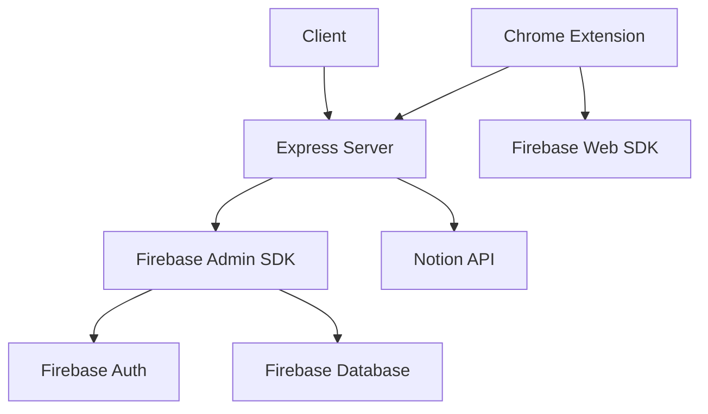

# Firebase Implementation Documentation

## Overview
This document provides comprehensive documentation for the Firebase implementation in the CanvasToNotion application. The application uses Firebase for authentication, real-time database, and user management.

## Table of Contents
1. [Architecture Overview](#architecture-overview)
2. [Configuration](#configuration)
3. [Authentication](#authentication)
4. [Database](#database)
5. [Security](#security)
6. [Error Handling](#error-handling)
7. [File Structure](#file-structure)
8. [API Endpoints](#api-endpoints)
9. [Development Guide](#development-guide)
10. [Testing](#testing)
11. [Deployment](#deployment)

## Architecture Overview

### Components
1. **Backend Server (Node.js/Express)**
   - Handles authentication logic
   - Manages Firebase Admin SDK
   - Provides REST API endpoints

2. **Firebase Services**
   - Authentication (Email/Password, Google)
   - Realtime Database
   - Admin SDK for server-side operations

3. **Chrome Extension**
   - Uses Firebase Web SDK
   - Handles user authentication
   - Manages real-time data synchronization

### System Architecture


## Configuration

### Environment Variables
Required environment variables for Firebase configuration:

```env
# Firebase Configuration
FIREBASE_API_KEY=your_api_key
FIREBASE_PROJECT_ID=your_project_id
FIREBASE_DATABASE_URL=your_database_url
GOOGLE_CLIENT_ID=your_google_client_id

# Optional Configuration
FIREBASE_AUTH_DOMAIN=your_auth_domain
FIREBASE_STORAGE_BUCKET=your_storage_bucket
FIREBASE_MESSAGING_SENDER_ID=your_messaging_sender_id
FIREBASE_APP_ID=your_app_id
```

### Firebase Client Configuration
```typescript
// config/firebase.ts
import { initializeApp } from 'firebase/app';
import { getAuth } from 'firebase/auth';
import { getDatabase } from 'firebase/database';

const config = {
  apiKey: process.env.FIREBASE_API_KEY,
  projectId: process.env.FIREBASE_PROJECT_ID,
  databaseURL: process.env.FIREBASE_DATABASE_URL,
  authDomain: process.env.FIREBASE_AUTH_DOMAIN,
  storageBucket: process.env.FIREBASE_STORAGE_BUCKET,
  messagingSenderId: process.env.FIREBASE_MESSAGING_SENDER_ID,
  appId: process.env.FIREBASE_APP_ID
};

const app = initializeApp(config);
export const auth = getAuth(app);
export const database = getDatabase(app);
```

### Firebase Admin SDK
```typescript
// config/firebase-admin.ts
import * as admin from 'firebase-admin';
import serviceAccount from '../serviceAccountKey.json';

if (!admin.apps.length) {
  admin.initializeApp({
    credential: admin.credential.cert(serviceAccount),
    databaseURL: process.env.FIREBASE_DATABASE_URL
  });
}

export const adminAuth = admin.auth();
export const adminDatabase = admin.database();
```

## Authentication

### Authentication Flow

#### 1. Email/Password Authentication
```typescript
// controllers/authControllers.ts
export const signup = async (req: Request, res: Response) => {
  try {
    const { email, password, displayName } = req.body;
    
    // Create user in Firebase Auth
    const userRecord = await adminAuth.createUser({
      email,
      password,
      displayName
    });

    // Create user profile in Realtime Database
    await adminDatabase.ref(`/users/${userRecord.uid}`).set({
      email,
      displayName,
      createdAt: new Date().toISOString()
    });

    res.status(201).json({ 
      message: 'User created successfully',
      uid: userRecord.uid 
    });
  } catch (error) {
    handleFirebaseError(error, res);
  }
};
```

#### 2. Google Authentication
```typescript
// controllers/authControllers.ts
export const googleAuth = async (req: Request, res: Response) => {
  try {
    const { idToken } = req.body;
    
    // Verify Google ID token
    const ticket = await googleClient.verifyIdToken({
      idToken,
      audience: process.env.GOOGLE_CLIENT_ID
    });
    
    const payload = ticket.getPayload();
    if (!payload?.email) {
      throw new Error('Invalid Google token');
    }

    // Get or create Firebase user
    let userRecord;
    try {
      userRecord = await adminAuth.getUserByEmail(payload.email);
    } catch {
      userRecord = await adminAuth.createUser({
        email: payload.email,
        displayName: payload.name,
        photoURL: payload.picture
      });
    }

    // Create custom token for extension
    const customToken = await adminAuth.createCustomToken(userRecord.uid);

    res.json({ customToken });
  } catch (error) {
    handleFirebaseError(error, res);
  }
};
```

### Token Management
```typescript
// middleware/auth.ts
export const verifyToken = async (
  req: AuthenticatedRequest,
  res: Response,
  next: NextFunction
) => {
  try {
    const idToken = req.headers.authorization?.split('Bearer ')[1];
    if (!idToken) {
      throw new Error('No token provided');
    }

    const decodedToken = await adminAuth.verifyIdToken(idToken);
    req.user = decodedToken;
    next();
  } catch (error) {
    res.status(401).json({ error: 'Invalid token' });
  }
};
```

## Database

### Database Structure
```typescript
interface UserData {
  profile: {
    email: string;
    displayName: string;
    photoURL?: string;
    createdAt: string;
    lastLogin: string;
  };
  settings: {
    preferences: {
      theme: 'light' | 'dark';
      notifications: boolean;
    };
  };
  notion: {
    integration: {
      accessToken: string;
      workspaceId: string;
    };
    pages: Array<{
      id: string;
      title: string;
      url: string;
    }>;
  };
  canvas: {
    courses: Array<{
      id: string;
      name: string;
      code: string;
    }>;
    assignments: Array<{
      id: string;
      title: string;
      dueDate: string;
      courseId: string;
    }>;
  };
}
```

### Database Operations
```typescript
// services/database.ts
export const databaseService = {
  async getUserData(userId: string): Promise<UserData> {
    const snapshot = await adminDatabase
      .ref(`/users/${userId}`)
      .once('value');
    return snapshot.val();
  },

  async updateUserProfile(userId: string, data: Partial<UserData['profile']>) {
    await adminDatabase
      .ref(`/users/${userId}/profile`)
      .update(data);
  },

  async addNotionPage(userId: string, page: UserData['notion']['pages'][0]) {
    await adminDatabase
      .ref(`/users/${userId}/notion/pages`)
      .push(page);
  }
};
```

## Security

### Security Rules
```json
{
  "rules": {
    "users": {
      "$uid": {
        ".read": "auth != null && auth.uid === $uid",
        ".write": "auth != null && auth.uid === $uid",
        "notion": {
          ".read": "auth != null && auth.uid === $uid",
          ".write": "auth != null && auth.uid === $uid"
        }
      }
    }
  }
}
```

### Security Measures
1. **Token-based Authentication**
   - JWT tokens for API requests
   - Custom tokens for extension authentication
   - Token verification middleware

2. **Data Protection**
   - Environment variables for sensitive data
   - Encrypted storage for API keys
   - Secure token storage in Chrome extension

## Error Handling

### Error Types
```typescript
interface FirebaseError {
  code: string;
  message: string;
  details?: any;
}

interface AuthError extends FirebaseError {
  authErrorCode: string;
  authErrorMessage: string;
}

interface DatabaseError extends FirebaseError {
  databaseErrorCode: string;
  databaseErrorMessage: string;
}
```

### Error Handler
```typescript
// utils/errorHandler.ts
export const handleFirebaseError = (error: any, res: Response) => {
  if (axios.isAxiosError(error)) {
    const errorMessage = error.response?.data?.error?.message || 'Operation failed';
    res.status(error.response?.status || 500).json({ error: errorMessage });
  } else {
    res.status(500).json({ error: 'Internal server error' });
  }
};
```

## Development Guide

### Local Setup
1. **Install Dependencies**
   ```bash
   npm install
   ```

2. **Environment Setup**
   ```bash
   cp .env.example .env
   # Edit .env with your Firebase credentials
   ```

3. **Start Development Server**
   ```bash
   npm run dev
   ```

### Testing
1. **Unit Tests**
   ```bash
   npm test
   ```

2. **Integration Tests**
   ```bash
   npm run test:integration
   ```

### Deployment
1. **Build**
   ```bash
   npm run build
   ```

2. **Deploy**
   ```bash
   npm run deploy
   ```

## API Endpoints

### Authentication
- `POST /auth/signup` - Create new user account
- `POST /auth/login` - Authenticate user
- `POST /auth/google` - Google authentication
- `POST /auth/logout` - Logout user

### User Management
- `GET /users/profile` - Get user profile
- `PUT /users/profile` - Update user profile
- `DELETE /users/account` - Delete user account

### Database
- `GET /database/users/:userId` - Get user data
- `PUT /database/users/:userId` - Update user data
- `DELETE /database/users/:userId` - Delete user data

### Notion Integration
- `POST /notion/connect` - Connect Notion account
- `GET /notion/pages` - Get Notion pages
- `POST /notion/sync` - Sync with Notion

## Troubleshooting

### Common Issues
1. **Authentication**
   - Token expiration
   - Invalid credentials
   - Provider configuration

2. **Database**
   - Permission denied
   - Invalid data format
   - Connection issues

3. **Extension**
   - Token storage
   - Background sync
   - Real-time updates

### Debug Tools
1. **Firebase Console**
   - Authentication logs
   - Database rules
   - Usage statistics

2. **Chrome DevTools**
   - Network requests
   - Console logs
   - Storage inspection

## Support
For issues related to Firebase implementation:
1. Check Firebase Console for error logs
2. Review application logs
3. Contact development team
4. Check Firebase status page

## Testing

### Unit Tests
- Authentication flows
- Database operations
- User management
- Notion integration

### Integration Tests
- API endpoints
- Firebase interactions
- Notion API integration
- Extension functionality

### Test Environment
- Local development setup
- Firebase emulators
- Mock Notion API
- Test database

## Deployment

### Environment Setup
1. **Development**
   - Local Firebase emulators
   - Development database
   - Test credentials

2. **Production**
   - Production Firebase project
   - Secure credentials
   - Monitoring setup

### Deployment Process
1. **Build**
   - TypeScript compilation
   - Asset optimization
   - Environment configuration

2. **Deploy**
   - Firebase hosting
   - Database rules
   - Security configuration

### Monitoring
1. **Performance**
   - API response times
   - Database operations
   - Authentication flows

2. **Errors**
   - Error tracking
   - Log aggregation
   - Alert configuration

## Configuration Management
- `firebase.ts`: Manages Firebase client configuration
- `firebase-admin.ts`: Handles Firebase Admin SDK setup
- `types.ts`: Provides configuration type definitions
- `index.ts`: Sets up application-wide configuration

[Rest of the documentation remains unchanged...] 